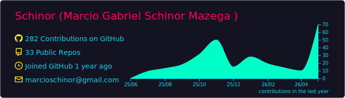
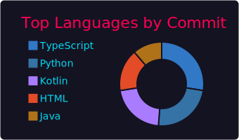
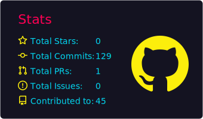

### 👋 Olá! Eu sou o Marcio Mazega 😊 | Hi there! I'm Marcio Mazega 👋

  

  
  
  

---

### 💼 Sobre mim | About Me

Sou **Data Engineering & Backend Intern** na **Gattaz Health** e graduando em **TSI na Fatec Pompeia**.  
Construindo a ponte entre dados brutos e decisões estratégicas, com foco em se tornar um **Full Cycle Data Scientist**.

Tenho experiência projetando pipelines de **ETL**, desenvolvendo **APIs** e estruturando dados relacionais.  
Apaixonado por tecnologia, mercado financeiro (Ações, FIIs e Cripto) e inovação. 💻✨

🏆 **Destaques:** 3º Lugar no DSIN Coder Challenge | Coautor de capítulos de livros científicos.

---

### 🧰 Tecnologias do meu dia a dia | Daily Tech Stack

  
  
  
  
  
  
  
  
  
  

  

---

### 🧠 Atualmente estudando | Currently Learning
- 🔹 **Machine Learning** — Modelagem preditiva e análise de dados avançada.
- 🔹 **Java (POO)** — APIs RESTful robustas com Spring Boot.
- 🔹 **Angular** — Desenvolvimento de interfaces dinâmicas e reativas.
- 🔹 **Arquitetura de Software** — Padrões de projeto e sistemas escaláveis.

---

### 🚀 Projetos em Destaque | Featured Projects

📊 **1. [PRF Analytics Full Cycle](https://github.com/Schinor)** (Data Engineering & ETL)  
Pipeline completo de extração, transformação e carga de dados de acidentes da Polícia Rodoviária Federal.  
*Stack: Python, Web Scraping (BeautifulSoup/Selenium), Pandas, PostgreSQL.*

🤖 **2. [PRF Collision Predictor](https://github.com/Schinor)** (Machine Learning)  
Modelo preditivo construído a partir da base de dados limpa e consolidada do projeto PRF Analytics.  
*Stack: Python, Scikit-Learn, Pandas, Matplotlib/Seaborn.*

☕ **3. [Task Manager API](https://github.com/Schinor)** (Backend & POO)  
API RESTful robusta para gerenciamento de tarefas, aplicando os princípios fundamentais de orientação a objetos.  
*Stack: Java, Spring Boot, PostgreSQL, Docker.*

🔴 **4. [Angular Pokédex](https://github.com/Schinor)** (Frontend)  
Aplicação web interativa para consumo e renderização assíncrona de dados de uma API externa.  
*Stack: Angular, TypeScript, HTML5, CSS3.*

---

### 🌐 Onde me encontrar | Find me online

  
  

---

✨ “Construindo a ponte entre dados brutos e decisões estratégicas.”  
✨ “Building the bridge between raw data and strategic decisions.”

---
