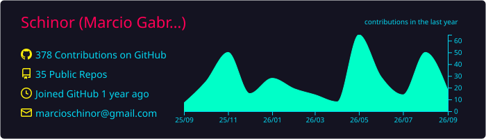
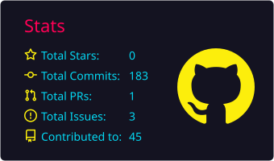
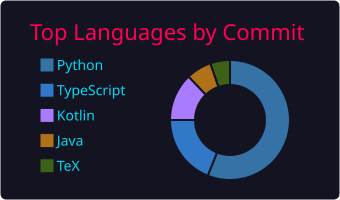

<div align="center">


<a href="https://github.com/Schinor">
  
</a>

<br/>

[](https://www.linkedin.com/in/marciomazega)
[](mailto:marciomazegaa@gmail.com)
[](https://github.com/Schinor)
[](https://github.com/Schinor)

</div>

---

## `$ whoami`

```python
marcio = {
    "nome":        "Marcio Gabriel Schinor Mazega",
    "cargo":       "Auxiliar de Tecnologia e Inovação — Amenco Peanuts",
    "localização": "Tupã, SP — Brasil",
    "formação":    "Tecnologia em Sistemas Inteligentes — Fatec Shunji Nishimura (2025–2027)",
    "foco":        ["Engenharia de Dados", "Machine Learning", "APIs RESTful", "BI"],
    "pesquisa":    ["FAPESP — Smart B100 (AgTech)", "CNPq — OBA (Astronomia)"],
    "objetivo":    "Full Cycle Data Scientist",
    "status":      "Construindo a ponte entre dados brutos e decisões estratégicas 🚀"
}
```

---

## 🧠 Sobre Mim

Sou **Engenheiro de Dados** em formação e hoje construo **pipelines de dados de ponta a ponta e soluções de Machine Learning** na **Amenco Peanuts**, no agronegócio: extração, tratamento, armazenamento e disponibilização de dados com **Python, SQL Server e PostgreSQL**, além de aplicações em Python + Angular seguindo **Domain-Driven Design**.

Antes, na **Gattaz Health**, participei da fundação da área de dados da empresa: ETL automatizado, redesign do schema PostgreSQL de dados clínicos, APIs com FastAPI e relatórios em Power BI.

Minha base metodológica vem da pesquisa: **bolsista FAPESP** (Living Labs no agronegócio) e **CNPq/OBA**, coautor de **2 capítulos de livro publicados** e **3º lugar no DSIN Coder Challenge 2025**.

**Objetivo:** atuar como _Full Cycle Data Scientist_ — da engenharia ao modelo em produção, do pipeline ao painel analítico.

---

## 🧰 Tech Stack

### Dados & IA
      

### Bancos de Dados & Backend
     

### Infraestrutura
   

### Web & Frontend
     

---

## 🗂️ Experiência

**🥜 Amenco Peanuts** — *Auxiliar de Tecnologia e Inovação I* `Jul 2026 – Atual | Tupã, SP`
> Pipelines de dados de ponta a ponta (extração → tratamento → armazenamento → disponibilização) · Análises e indicadores em SQL Server e PostgreSQL · Soluções de Machine Learning e contato com Deep Learning · Aplicações Python + Angular com DDD

**🏥 Gattaz Health** — *Estagiário de Engenharia de Dados* `Fev 2026 – Jun 2026 | São Paulo, SP (Remoto)`
> Estruturação da área de dados da empresa · Pipelines ETL em Python · Redesign do schema PostgreSQL de dados clínicos · APIs RESTful com FastAPI · Relatórios gerenciais em Power BI

**🌱 Centro Avançado de Pesquisa Smart B100** — *Pesquisador de Iniciação Científica (Bolsista FAPESP)* `Set 2025 – Fev 2026 | Pompeia, SP`
> Modelagem do Living Lab na plataforma CCD-SB100 · Mapeamento e estruturação de dados de tecnologias digitais usadas por produtores rurais

**🔭 OBA — Olimpíada Brasileira de Astronomia** — *Pesquisador de IC Júnior (Bolsista CNPq)* `Jan 2024 – Jan 2025`
> Programa de excelência acadêmica de 12 meses · Hoje atuo como monitor do programa ICJr, orientando e revisando relatórios de estudantes

---

## 🚀 Projetos em Destaque

<!-- Troque cada link pelo endereço do repositório, ex.: https://github.com/Schinor/prf-analytics -->

### 🌾 [Central Agro](https://github.com/Schinor)
> **SaaS de inteligência agronômica** — ETL geoespacial via Google Earth Engine cruzando NDVI com variáveis meteorológicas. Modelos de ML entregam insights preditivos para produtores rurais.

`Python` `Google Earth Engine` `Scikit-learn` `Pandas` `ETL` `React`

### 📊 [PRF Analytics Full Cycle](https://github.com/Schinor)
> **Pipeline de dados full cycle** sobre os dados abertos de acidentes da Polícia Rodoviária Federal (2007–2026) — crawler com Playwright, tratamento, padronização e carga em banco relacional para análise histórica e dashboards.

`Python` `Playwright` `Pandas` `PostgreSQL` `Power BI`

### 🤖 [PRF Collision Predictor](https://github.com/Schinor)
> **Modelo preditivo de severidade de acidentes** construído sobre a base do PRF Analytics, explorando padrões geoespaciais e temporais para identificar zonas de risco.

`Python` `Scikit-learn` `Pandas` `Seaborn`

### 🕸️ [Web Crawler Universitário](https://github.com/Schinor)
> **Projeto Integrador (Fatec)** — crawler que automatiza a coleta e centraliza informações publicadas nos sites das Fatecs, com aprendizado de máquina embutido, para um parceiro do Centro Paula Souza.

`Python` `Web Scraping` `Machine Learning` `API`

### 🏙️ [Ouvidoria Digital — Synapse — Finalizado](https://github.com/Schinor)
> **Solução Full Stack** para digitalizar processos físicos da Zeladoria Municipal, com mapas interativos (Leaflet) e autenticação JWT.

`Angular` `Node.js` `TypeScript` `MySQL` `Leaflet` `JWT`

### 🦯 [CANNA — Bengala Multissensorial](https://github.com/Schinor)
> Tecnologia assistiva apresentada na **FETEPS (Centro Paula Souza)**, combinando sensores e processamento embarcado para auxílio à mobilidade.

`IoT` `Sensores` `Tecnologia Assistiva`

---

## 📈 GitHub Stats

<!-- Cards gerados pelo workflow .github/workflows/profile-cards.yml (salvos neste repositório, não dependem de servidor externo) -->
<div align="center">
  
</div>

<div align="center">
  
  
</div>

<div align="center">
  
</div>

---

## 🏆 Conquistas & Destaques

| 🎖️ | Conquista |
|---|---|
| 🥉 | **3º Lugar — DSIN Coder Challenge** (Dez/2025) — desafio de lógica e programação entre Fatecs do Estado de SP |
| 📚 | **Coautor de 2 capítulos de livro** — Laboratórios Vivos no Agronegócio & Indústria Cultural e Alienação das Massas |
| 🔬 | **Bolsista FAPESP** — Centro Avançado de Pesquisa Smart B100 (AgTech & Living Labs) |
| 🌌 | **Bolsista CNPq** — Iniciação Científica Júnior (OBA/OBAFOG, 2024) e monitor do programa ICJr |
| 🚀 | **FETEPS 2025** — Projeto CANNA apresentado na feira de tecnologia do Centro Paula Souza |
| 🏫 | **Escola de Inovadores (INOVA CPS)** — 20ª edição, 40h (2025) |

---

## 📜 Certificações

| | Certificação | Instituição | Ano |
|---|---|---|---|
| ✅ | Introdução ao Machine Learning com Python | USP / ESALQ | 2026 |
| ✅ | Ciência de Dados com Python | Santander / DIO | 2026 |
| ✅ | Visão de Máquina na Prática | EncData — Fatec Pompeia | 2025 |
| ✅ | Banco de Dados Relacional com SQL | EncData — Fatec Pompeia | 2025 |
| ✅ | Python | Santander / DIO | 2025 |
| ✅ | Escola de Inovadores | INOVA CPS | 2025 |
| 🔄 | ML Specialist | DIO | Em andamento |
| 🔄 | GenAI & Dados | Bradesco | Em andamento |

---

## 📚 Publicações

- 📖 **"Laboratórios Vivos no Agronegócio"** — Coautor · Living Labs e o ecossistema digital rural
- 📖 **"A Indústria Cultural e a Alienação das Massas"** — Coautor · Análise comparativa entre o boom dos anos 20 e a era digital · [DOI: 10.56238/sevened2024.037-056](https://doi.org/10.56238/sevened2024.037-056)

---

## 🐍 Contribuições

<div align="center">
  <picture>
    <source media="(prefers-color-scheme: dark)" srcset="https://raw.githubusercontent.com/Schinor/Schinor/output/github-contribution-grid-snake-dark.svg" />
    <source media="(prefers-color-scheme: light)" srcset="https://raw.githubusercontent.com/Schinor/Schinor/output/github-snake.svg" />
    
  </picture>
</div>

---

<div align="center">


*"Construindo a ponte entre dados brutos e decisões estratégicas."*

</div>